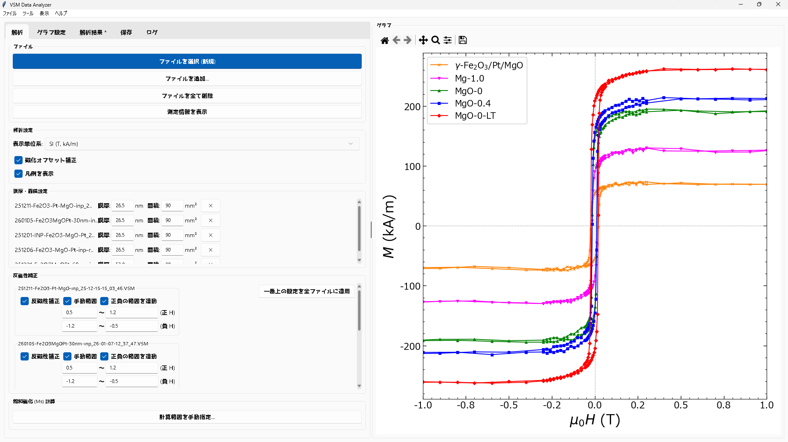
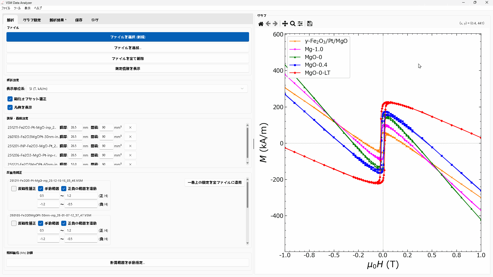
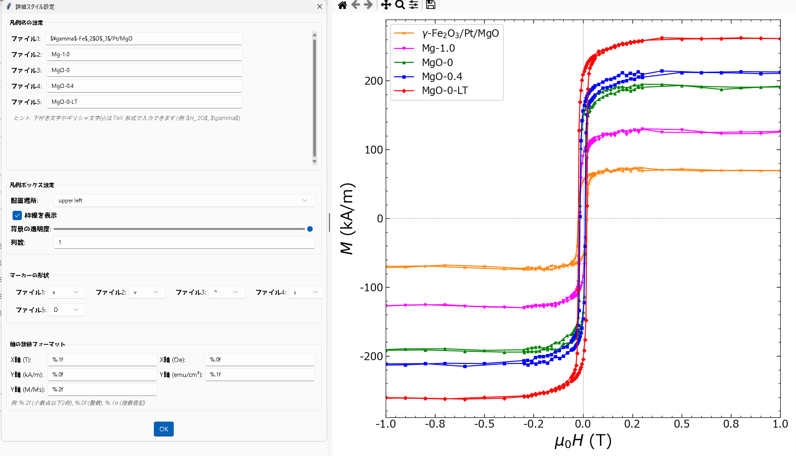
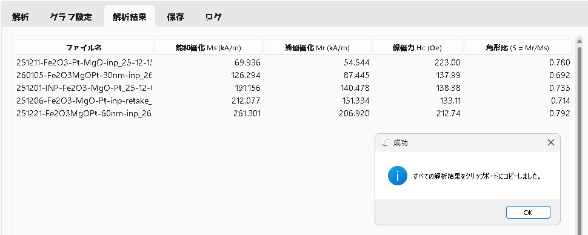

<div align="center">
  <h1> VSM Data Analyzer</h1>
  <p>磁性材料の磁気特性測定データ（VSM / PPMS）を解析・可視化するデスクトップアプリケーション</p>
  
  
  
  
  
</div>

## 目次
<details>
<summary>クリックして展開</summary>

- [プロジェクト概要](#プロジェクト概要)
- [開発の背景](#開発の背景)
- [開発の目的と解決策](#開発の目的と解決策)
- [主な機能と特徴](#主な機能と特徴)
  - [1. データの読み込みと管理](#1-データの読み込みと管理)
  - [2. データ補正と物理量算出](#2-データ補正と物理量算出)
  - [3. インタラクティブなグラフ描画](#3-インタラクティブなグラフ描画)
  - [4. データ管理と出力](#4-データ管理と出力)
- [技術スタックとアーキテクチャ](#技術スタックとアーキテクチャ)
  - [使用技術と選定理由](#使用技術と選定理由)
  - [アーキテクチャ](#アーキテクチャ)
  - [設計の工夫](#設計の工夫)
- [クイックスタート](#クイックスタート)
- [開発者向けセットアップ](#開発者向けセットアップ)
- [テストの実行](#テストの実行)
- [今後の展望](#今後の展望)

</details>

## プロジェクト概要

**VSM Data Analyzer** は、磁気特性測定データ（VSM, PPMS）の解析を高度に自動化・効率化するために開発されたデスクトップアプリケーションである。煩雑なデータの補正から各種物理量の自動算出、そして高精細なグラフ描画までをワンストップで完結させることができる。

**Tauri 2（Rust）+ React / TypeScript のフロントエンド**と**Python（FastAPI）バックエンド**で構成され、Web技術によるモダンなUIと、Pythonの科学計算資産の両方を享受できる構成となっている。



> **開発の経緯**: 本アプリは当初 Python / Tkinter 製の単体GUIとして開発されたが、UI/UXの柔軟性と保守性を高めるため、解析ロジック（Python）を FastAPI バックエンドとして分離し、UIを Tauri + React へ全面移行した。旧 Tkinter 実装は Git 履歴に保存されている。

---

## 開発の背景

磁性材料研究における測定データ（VSM, PPMS等）の解析フローには、これまで**非効率性と属人化**という大きな課題が存在していた。

- **データ補正**: 測定機器から出力される生データには、主に基板に由来する**線形な反磁性成分**や、測定機器のドリフト等による**原点のオフセット**が重畳していることが多い。正確なヒステリシスループ（$M-H$ カーブ）を得るためには、これらを数学的に除去する必要がある。
- **物理量算出とグラフ化**: 飽和磁化 ($M_s$) や保磁力 ($H_c$) といった主要な物理量の算出、および論文投稿用の高品質なグラフ作成を、Excelや汎用ソフト（Ngraph等）を用いて手作業で行うことは、大きな時間的コストとなっていた。
- **解析プロセスの属人化**: 各研究者が独自に解析を行うため、手順が属人化しやすく、解析結果の客観性やフォーマットの統一を保つことが困難であった。

## 開発の目的と解決策

本アプリケーションは、上記の煩雑な解析フローを**一つの直感的なGUIアプリケーション上に統合**し、研究の生産性を劇的に向上させることを目的としている。

- **解析フローの自動化**: データの読み込みから反磁性・オフセット補正、物理量の自動算出までを数クリックで完結。
- **グラフ即時出力**: 単位系変換（SI, CGS等）やフォーマット調整をリアルタイムに反映し、高品質な画像として即座に様々な形式でエクスポート可能。
- **再現性の確保**: 標準化されたアルゴリズムによる補正と、解析セッションの保存機能により、同じ手順で客観的な解析結果を得ることができる体制を実現。

## 主な機能と特徴

### 1. データの読み込みと管理

- **複数ファイルの一括読み込み**: ファイル選択ダイアログから複数の `.VSM` ファイルをまとめて読み込み、瞬時に一括解析・描画が可能。
- **データ変換ツールの内包**: Quantum Design社製 PPMS から出力される `.dat` ファイルを、標準的な `.VSM` 形式へ変換する専用ツールをUIから呼び出す。
- **測定メタデータの確認**: 読み込んだデータファイルに記録されている測定日時、サンプル名、感度、最大磁場などのメタデータを一覧表示。
- **柔軟なリスト管理**: 読み込んだファイルの描画順序の入れ替え、個別の非表示・削除、色の変更などが直感的なUIから行える。

### 2. データ補正と物理量算出



- **反磁性・常磁性補正**: $M-H$ カーブの高磁場領域から線形な反磁性成分を自動的に検出し、補正係数（傾き $\chi$）を算出・減算する。ユーザーによる任意の磁場範囲の手動指定にも対応。
  - **一括適用機能**: 一つのファイルで設定した補正範囲（正負連動）を、ワンクリックで全データに一括適用でき、大量データの処理を効率化する。
- **オフセット補正**: 最大・最小磁場付近の磁化の平均値から、測定機器のドリフト等に起因する原点ズレを自動補正。
- **磁気特性の自動評価**: 補正後のデータから、以下の主要パラメータを即座に算出し、表として一覧表示。
  - 飽和磁化 ($M_s$)
  - 残留磁化 ($M_r$)
  - 保磁力 ($H_c$)
  - 飽和磁場 ($H_s$)
  - 角形比 ($S = M_r / M_s$)
- **体積磁化算出**: 膜厚(nm)および面積(mm²)を入力することで、生データ(emu)から体積磁化を正確に算出。
- **計算ロジックの透明性**: アプリ内で「どのように補正・計算が行われているか」を数式（KaTeX）付きで解説するヘルプウィンドウを搭載し、ブラックボックス化を防止。

### 3. インタラクティブなグラフ描画



- **単位系のワンクリック切り替え**: SI単位系 (T, kA/m)、CGS単位系 (Oe, emu/cm³)、規格化 ($M/M_s$) を、UIのプルダウンからリアルタイムに変更。
- **詳細なスタイル制御**: **Plotly.js** を基盤とし、線の太さ、マーカーの形状・色、フォントサイズ、グリッド線、凡例の透過度・配置など、学会誌の厳格なフォーマット要求に応える詳細なカスタマイズが可能。
  - **TeX記法サポート**: 軸ラベルや凡例名に下付き文字やギリシャ文字（例: `$H_2O$`, `$\gamma$`, `$M$ (emu/cm$^3$)`）などのTeX記法が使用可能。
  - **リアルタイムプレビュー**: 数値や設定を変更した際、再描画の遅延処理（デバウンス）を行うことで、UIのもたつきを防ぎながら変更をリアルタイムに確認。
- **モダンなUI/UX**: Tailwind CSS ベースの洗練されたUIで、ダークモード / ライトモードの切り替えに対応。ウィンドウ下部のステータスバーで読み込みファイル数や豆知識を常時表示。

### 4. データ管理と出力



- **セッションの保存・復元**: 現在読み込んでいるファイルパスのリストや、各ファイルに対する個別の補正設定（膜厚、色、補正範囲など）を `.vsm_session` ファイルとして保存できる。**相対パス／OneDrive パスによる復元アルゴリズム**をバックエンドに実装しており、クラウドストレージ経由で別のPCでも作業を完全に再現可能。
- **高解像度エクスポート**: 描画されたグラフを、ベクター画像（SVG, PDF）やラスター画像（PNG）として保存。
- **解析結果のシームレスな共有**: 算出された各サンプルのパラメータ一覧を、ExcelやPowerPointに直接ペースト可能な TSV / HTML 形式でクリップボードにコピーする機能を備える。
- **実行ログの記録**: 解析の過程やエラー情報、保存時の詳細などを「ログ」タブに記録し、トラブルシューティングを容易に。

---

## 技術スタックとアーキテクチャ

### 使用技術と選定理由

| カテゴリ | 使用技術 | 選定理由 |
| :--- | :--- | :--- |
| **デスクトップ基盤** | Tauri 2 (Rust) | OSネイティブのWebViewでWebフロントを動かす軽量フレームワーク。小さいバイナリで配布可能 |
| **フロントエンド** | React 19 / TypeScript | 型安全な宣言的UI。複雑な解析設定の状態管理に対応 |
| **UI / スタイル** | Tailwind CSS 4 | 一貫したデザインとダーク/ライト対応を高速に実装 |
| **ビルドツール** | Vite 7 | 高速な開発サーバとバンドル |
| **グラフ描画** | Plotly.js (react-plotly.js) | インタラクティブかつ論文品質の科学グラフ描画 |
| **数式表示** | KaTeX | ヘルプやラベルの数式を高品質にレンダリング |
| **バックエンド** | FastAPI (Python) | ローカル HTTP API (`:8000`) として解析ロジックを提供 |
| **データ処理** | Pandas / NumPy | 測定データの高速ベクトル演算 |
| **数値計算** | SciPy | 線形回帰（反磁性係数 $\chi$）・ゼロ交差点補間（保磁力 $H_c$） |
| **配布ビルド** | PyInstaller + Tauri Bundler | バックエンドを `backend.exe` サイドカー化し、`.msi` / `.exe` インストーラに同梱 |
| **テスト** | pytest | 純粋関数のユニットテスト |
| **バージョン管理** | Git / GitHub | コード管理・リリース配布 |

---

### アーキテクチャ

フロントエンド（React）とバックエンド（FastAPI）は、ローカルの HTTP API を介して疎結合に連携する。
グラフ描画はフロントエンドが担当し、数値解析はすべてバックエンドの Python が担う。

```
[ Tauri アプリ (デスクトップウィンドウ) ]
        │
  vsm-tauri/               React + TypeScript フロントエンド
    src/App.tsx            中央 state（ファイル・解析結果・グラフ設定）
    src/api/client.ts      HTTP fetch → localhost:8000
    src/components/        Graph(Plotly) / Sidebar / ResultsTable / HelpDialog ...
    src-tauri/src/lib.rs   Rust: backend.exe サイドカーの起動と終了管理
        │
        │  HTTP (JSON)  ローカル :8000
        ▼
  backend/                 FastAPI サーバ
    routers/analysis.py    POST /api/analyze     — 解析結果 JSON を返す
    routers/session.py     /api/session/*        — セッションのパス解決
        │
        ▼
  analysis/                純粋ロジック層（バックエンドとテストが共用）
    calculations.py        Ms / Mr / Hc / Hs 計算・反磁性/オフセット補正
    file_io.py             .VSM 読み込み・メタデータ解析
```

**データフロー**: ファイルとパラメータ（膜厚・面積・補正モード等）をフロントが `multipart/form-data` で
`POST /api/analyze` に送信 → バックエンドが `calculations.py` で解析 → Ms/Mr/Hc/Hs と描画用配列（往路/復路）を
JSON で返す → フロントが Plotly.js で $M-H$ ループを描画。

---

### 設計の工夫

**計算ロジックをUIから完全に切り離す**
数値解析は `analysis/calculations.py` のGUI非依存な純粋関数に集約されている。この層をFastAPIバックエンドと
pytestの両方が共用するため、**テストが実質的に本番の計算経路を保証**する構成になっている。

**連続入力でもUIがもたつかないグラフ更新**
補正係数や膜厚を調整するたびに再解析・再描画するとUIが重くなる。最後の入力が確定してから一度だけ
再描画するデバウンス方式を採用し、リアルタイム性と軽快さを両立している。

**バックエンドプロセスのライフサイクル管理**
アプリはPythonバックエンドを子プロセスとして起動する。Windowsの `.venv` python はシム（本体を孫として起動する
中継役）であり単純な終了では孫が残るため、開発起動（`main.py`）では `taskkill /T` でツリーごと後片付けし、
本番（Tauri `lib.rs`）では `RunEvent::ExitRequested` で確実に `kill()` する。これにより、アプリを閉じても
バックエンドが残り続ける（ポートを占有し続ける）問題を防いでいる。

**ローカルAPIへの安全な接続**
Tauri本番環境（`tauri://localhost` / `https://tauri.localhost`）から `http://localhost:8000` への通信は、
CORS と Chrome の Private Network Access (PNA) の制約を受ける。バックエンドで許可オリジンと
`Access-Control-Allow-Private-Network` ヘッダーを適切に付与し、ブロックされないようにしている。

**クラウド経由でも再現できるセッション保存**
`.vsm_session` のファイルパスは絶対パスではなく相対パス／OneDriveパスで保存する。フォルダを別PCに同期した
場合でも、バックエンドのパス解決API (`/api/session/resolve`) が正しくファイルを見つけ、作業状態を再現できる。

---

## クイックスタート

> **動作環境: Windows 10/11**

**ステップ 1 — ダウンロード**

GitHubの [Releases ページ](https://github.com/shrhrt/VSM_ANALYSIS/releases) から最新のインストーラ（`.msi` または `.exe`）をダウンロード。

**ステップ 2 — インストールと起動**

インストーラを実行してインストール後、スタートメニューまたはデスクトップから **VSM Analyzer** を起動。

> **SmartScreen警告が表示された場合**
> 「詳細情報」→「実行」の順に選択。

**ステップ 3 — データ読み込み**

「ファイルを開く」から `.VSM` ファイルを選択するとグラフが描画される。

---

## 開発者向けセットアップ

**必要環境**:
- [Python 3.11+](https://www.python.org/downloads/)
- [Node.js](https://nodejs.org/)（フロントエンド）
- [Rust ツールチェーン](https://www.rust-lang.org/tools/install)（Tauri のビルド）

```bat
:: リポジトリのクローン
git clone https://github.com/shrhrt/VSM_ANALYSIS.git
cd VSM_Analysis

:: Python 仮想環境の作成・有効化
python -m venv .venv
.venv\Scripts\activate

:: Python 依存（バックエンド + テスト）
pip install -r requirements.txt

:: フロントエンド依存
cd vsm-tauri && npm install && cd ..

:: 開発起動（バックエンド + Tauri ウィンドウをまとめて起動し、閉じると後片付けまで行う）
python main.py
```

**配布用インストーラのビルド**

```bat
python build.py
```

`build.py` は「① PyInstaller でバックエンドを `backend.exe` 化 → ② Tauri のサイドカーとして配置 → ③ `tauri build`」を自動で行い、
`vsm-tauri/src-tauri/target/release/bundle/` にインストーラを生成する。

## テストの実行

解析ロジックの正当性を確認するため、以下のコマンドでテストスイートを実行。

```bash
pytest -v
```

## 今後の展望

本アプリケーションはコア機能が完成しており、以下の拡張を検討している。

- **グラフ上でのインタラクティブな範囲指定**: 反磁性補正の磁場範囲や $M_s$ 計算範囲を、数値入力ではなくグラフ上のマウスドラッグで直感的に指定できる操作性の実現。
- **総合的な材料解析プラットフォームへの拡張**: 現在のVSM（$M-H$カーブ）解析に加え、X線回折（XRD）や磁化の温度依存性（$M-T$カーブ）など、異なる測定手法のデータも管理・比較できるソフトウェアへの進化。
- **CI/CDパイプラインの構築**: GitHub Actions を導入し、`pytest` の自動実行・静的コード解析、および Tauri アプリの自動ビルド・リリース体制を構築。
