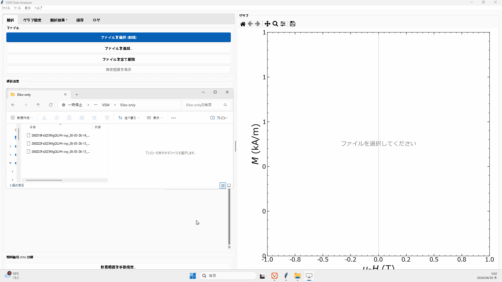

<div align="center">
  <h1> VSM Data Analyzer</h1>
  <p>磁性材料の磁気特性測定データ（VSM / PPMS）を解析・可視化するデスクトップGUIアプリケーション</p>
  
  
  
</div>

## 目次
<details>
<summary>クリックして展開</summary>

- [プロジェクト概要](#プロジェクト概要)
- [開発の背景](#開発の背景)
- [開発の目的と解決策](#開発の目的と解決策)
- [主な機能と特徴](#主な機能と特徴)
  - [1. 柔軟で高速なデータ読み込み](#1-柔軟で高速なデータ読み込み)
  - [2. データ補正と物理量算出](#2-データ補正と物理量算出)
  - [3. インタラクティブなグラフ描画](#3-インタラクティブなグラフ描画)
  - [4. データ管理と出力](#4-データ管理と出力)
- [主な使用技術](#主な使用技術)
  - [設計の工夫](#設計の工夫)
- [導入と使用方法](#導入と使用方法)
  - [実行ファイル (.exe) による利用（一般ユーザー向け）](#実行ファイル-exe-による利用一般ユーザー向け)
  - [ソースコードからの実行（開発者向け）](#ソースコードからの実行開発者向け)
- [テストの実行](#テストの実行)
- [今後の展望](#今後の展望)

</details>

## プロジェクト概要

**VSM Data Analyzer** は、磁気特性測定データ（VSM, PPMS）の解析を高度に自動化・効率化するために開発されたデスクトップGUIアプリケーションである。煩雑なデータの補正から各種物理量の自動算出、そして高精細なグラフ描画までをワンストップで完結させることができる。


---

## 開発の背景

磁性材料研究における測定データ（VSM, PPMS等）の解析フローには、これまで**非効率性と属人化**という大きな課題が存在していた。

- **データ補正**: 測定機器から出力される生データには、主に基板に由来する**線形な反磁性成分**や、測定機器のドリフト等による**原点のオフセット**が重畳していることが多い。正確なヒステリシスループ（$M-H$ カーブ）を得るためには、これらを数学的に除去する必要がある。
- **物理量算出とグラフ化**: 飽和磁化 ($M_s$) や保磁力 ($H_c$) といった主要な物理量の算出、および論文投稿用の高品質なグラフ作成を、Excelや汎用ソフト（Ngraph等）を用いて手作業で行うことは、大きな時間的コストとなっていた。
- **解析プロセスの属人化**: 各研究者が独自に解析を行うため、手順が属人化しやすく、解析結果の客観性やフォーマットの統一を保つことが困難であった。

## 開発の目的と解決策

本アプリケーションは、上記の煩雑な解析フローを**一つの直感的なGUIアプリケーション上に統合**し、研究の生産性を劇的に向上させることを目的としている。

- **解析フローの自動化**: データの読み込みから反磁性・オフセット補正、物理量の自動算出までを数クリックで完結。
- **グラフ即時出力**: 単位系変換（SI, CGS等）やフォーマット調整をリアルタイムに反映し、高品質な画像として即座に様々な形式でエクスポート可能。
- **再現性の確保**: 標準化されたアルゴリズムによる補正と、解析セッションの保存機能により、同じ手順で客観的な解析結果を得ることができる体制を実現。

## 主な機能と特徴

### 1. 柔軟で高速なデータ読み込み



- **ドラッグ＆ドロップ対応**: エクスプローラーから複数の `.VSM` ファイルを直接画面にドロップし、瞬時に一括読み込みが可能。
- **データ変換ツールの内包**: Quantum Design社製 PPMSから出力される `.dat` ファイルを、標準的な `.VSM` 形式へ変換する専用ツールをUI内（メニューバー）から呼び出す。
- **測定メタデータの確認**: 読み込んだデータファイルに記録されている測定日時、サンプル名、感度、最大磁場などのメタデータを専用ウィンドウで一覧表示。
- **柔軟なリスト管理**: 読み込んだファイルの描画順序の入れ替え、個別の非表示・削除、全データのクリアが直感的なUIから行える。

### 2. データ補正と物理量算出


- **反磁性・常磁性補正**: $M-H$ カーブの高磁場領域から線形な反磁性成分を自動的に検出し、補正係数（傾き $\chi$）を算出・減算する。ユーザーによる任意の磁場範囲の手動指定にも対応。
  - **一括適用機能**: 一つのファイルで設定した補正範囲（正負連動）を、ワンクリックで全データに一括適用でき、大量データの処理を効率化する。
- **オフセット補正**: 最大・最小磁場付近の磁化の平均値から、測定機器のドリフト等に起因する原点ズレを自動補正。
- **磁気特性の自動評価**: 補正後のデータから、以下の主要パラメータを即座に算出し、表として一覧表示。
  - 飽和磁化 ($M_s$)
  - 残留磁化 ($M_r$)
  - 保磁力 ($H_c$)
  - 角形比 ($S = M_r / M_s$)
- **体積磁化算出**: 膜厚(nm)および面積(mm²)を入力することで、生データ(emu)から体積磁化を正確に算出。
- **計算ロジックの透明性**: アプリ内で「どのように補正・計算が行われているか」を解説するヘルプウィンドウを搭載し、ブラックボックス化を防止。

### 3. インタラクティブなグラフ描画


- **単位系のワンクリック切り替え**: SI単位系 (T, kA/m)、CGS単位系 (Oe, emu/cm³)、規格化 ($M/M_s$) を、UIのプルダウンからリアルタイムに変更。
- **詳細なスタイル制御**: Matplotlibを基盤とし、線の太さ、マーカーの形状・色、フォントサイズ、グリッド線、凡例の透過度・配置など、学会誌の厳格なフォーマット要求に応える詳細なカスタマイズが可能。
  - **TeX記法サポート**: 凡例名には下付き文字やギリシャ文字（例: `$H_2O$`, `$\gamma$`）などのTeX記法が使用可能。
  - **リアルタイムプレビュー**: 数値や設定を変更した際、再描画の遅延処理（デバウンス）を行うことで、UIのフリーズを防ぎながら変更をリアルタイムに確認。
- **モダンなUI/UX**: `sv-ttk` テーマを採用し、Windows 11にネイティブに馴染むデザインと、ダークモード / ライトモードの動的切り替えを提供。ウィンドウ下部のステータスバーで読み込みファイル数・最終解析日時を常時表示。

### 4. データ管理と出力


- **セッションの保存・復元**: 現在読み込んでいるファイルパスのリストや、各ファイルに対する個別の補正設定（膜厚、色、補正範囲など）を `.vsm_session` ファイルとして保存できる。相対パスによる復元アルゴリズムを実装しており、OneDrive等のクラウドストレージ経由で別のPCでも作業を完全に再現可能。
- **高解像度エクスポート**: 描画されたグラフを、任意のDPIとサイズでベクター画像（SVG, PDF）やラスター画像（PNG, JPEG）として保存。
- **グラフのクリップボードコピー**: グラフを1クリックでクリップボードにコピーし、PowerPointやWordに直接貼り付け可能（DIB形式）。
- **解析結果のシームレスな共有**: 算出された各サンプルのパラメータ一覧を、ExcelやPowerPointに直接ペースト可能なTSV形式またはHTML形式でクリップボードにコピーする機能を備える。
- **実行ログの記録**: 解析の過程やエラー情報、保存時の詳細などを「ログ」タブに記録し、トラブルシューティングを容易に。

## 主な使用技術

| カテゴリ | 使用技術 |
| :--- | :--- |
| **開発言語** | Python 3.11+ |
| **GUIフレームワーク** | Tkinter, ttk (Python標準ライブラリ) |
| **GUI拡張・テーマ** | sv-ttk, tkinterdnd2 |
| **データ解析・演算** | Pandas, NumPy, SciPy |
| **データ可視化** | Matplotlib |
| **テスト** | pytest |
| **バージョン管理・その他** | Git, GitHub |

### 設計の工夫
- **関心事の分離 (SoC)**: UIコンポーネント、状態管理 (`StateManager`)、グラフ描画 (`GraphManager`)、イベント処理 (`EventHandlers`)、そして純粋な数学的演算 (`analysis` モジュール) を明確にクラス分割し、密結合を防いでいる。
- **デバウンス更新**: UI変数の変更から500msの遅延を挟んでグラフ再描画を行うことで、連続入力時の過剰な再描画を防ぎUXを向上。
- **堅牢な品質保証**: 物理量の算出アルゴリズムに対して `pytest` を用いたユニットテストを記述し、境界値やエッジケースに対する数学的な正確性を継続的に保証する体制を整えている。

## 導入と使用方法

本アプリケーションは、Python環境の構築が不要な **実行ファイル (.exe) による利用** が可能。

### 実行ファイル (.exe) による利用（一般ユーザー向け）

1. **ダウンロード**
   GitHubの [Releases ページ](https://github.com/shrhrt/VSM_ANALYSIS/releases/tag/v1.0) より、最新バージョンのzipファイルをダウンロード。
2. **展開と配置**
   ダウンロードしたzipファイルを解凍し、任意のフォルダに配置。
3. **起動**
   フォルダ内の実行ファイル（`VSM_Analyzer.exe`）をダブルクリックしてアプリケーションを起動。

> **💡 Note: セキュリティ警告について**
> 初回起動時、WindowsのSmartScreen機能により「Windows によって PC が保護されました」という青い警告画面が表示される場合がある。**「詳細情報」をクリックし、右下に現れる「実行」ボタンを選択する**ことで、安全に起動。

### ソースコードからの実行（開発者向け）

**前提条件**: 実行環境に [Python 3.11 以上](https://www.python.org/downloads/) がインストールされていること。

開発や機能のカスタマイズを行う場合は、以下の手順に従いソースコードから環境構築および起動を行う。

1. **リポジトリの取得**
   コマンドプロンプトやターミナルを開き、ソースコードをクローンしてディレクトリを移動する。
   ```bash
   git clone https://github.com/shrhrt/VSM_ANALYSIS.git
   cd VSM_Analysis
   ```

2. **仮想環境の作成と有効化（推奨）**
   プロジェクト専用の独立したPython環境を構築。
   ```bash
   # 仮想環境を作成（"env" という名前のディレクトリが作成される）
   python -m venv env

   # 仮想環境を有効化する（Windowsの場合）
   env\Scripts\activate

   # 仮想環境を有効化する（macOS / Linuxの場合）
   source env/bin/activate
   ```

3. **必要なライブラリのインストール**
   ```bash
   pip install -r requirements.txt
   ```

4. **アプリケーションの起動**
   ```bash
   python main.py
   ```

## テストの実行

解析ロジックの正当性を確認するため、以下のコマンドでテストスイートを実行。

```bash
pytest -v
```

## 今後の展望

本アプリケーションはコア機能が完成しており、以下の拡張を検討している。

- **グラフ上でのインタラクティブな範囲指定**: 反磁性補正の磁場範囲や $M_s$ 計算範囲を、数値入力ではなくグラフ上のマウスドラッグで直感的に指定できる操作性の実現。
- **総合的な材料解析プラットフォームへの拡張**: 現在のVSM（$M-H$カーブ）解析に加え、X線回折（XRD）や磁化の温度依存性（$M-T$カーブ）など、異なる測定手法のデータも管理・比較できるソフトウェアへの進化。
- **CI/CDパイプラインの構築**: GitHub Actionsを導入し、`pytest` の自動実行・静的コード解析、および PyInstaller を用いた実行ファイルの自動ビルド・リリース体制を構築。
